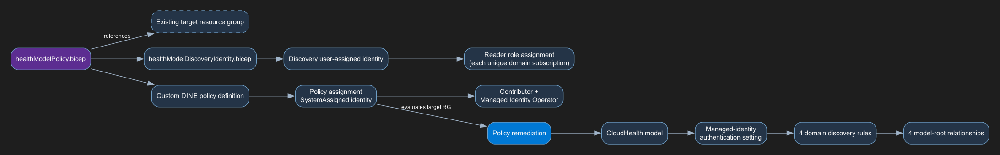

# Module: CloudHealth Platform Health Model Policy (Preview)

This subscription-scope module deploys a custom policy for a Microsoft CloudHealth
platform health model. `parDeployHealthModel` maps `true` (the default) to
`DeployIfNotExists` and `false` to `Disabled`. The policy definition, assignment,
identities, and RBAC remain deployed in both states. This is a preview
implementation for [Azure/ahm-planning#3553](https://github.com/Azure/ahm-planning/issues/3553).

The module deploys:

- one custom policy definition and subscription assignment with a system-assigned identity;
- one user-assigned identity for CloudHealth discovery;
- Contributor and Managed Identity Operator for the remediation identity at the assignment subscription;
- Reader for the discovery identity at every unique configured domain subscription;
- one model, one managed-identity authentication setting, four discovery rules, and four root relationships when remediation runs.

The target resource group is caller-owned and must already exist. The module does
not create or delete it.

## Parameters

- [Health model policy parameters](generateddocs/healthModelPolicy.bicep.md)
- [Discovery identity parameters](generateddocs/healthModelDiscoveryIdentity.bicep.md)

Each domain query has this shape:

```kusto
resources
| where subscriptionId =~ '<subscription-id>'
| where tags['<key>'] =~ '<value>'
| where type in~ ('<global-and-domain-type-union>')
| project id
```

The tag clause is omitted when no filters are supplied. Every configured tag pair
is added as an AND clause. The resource type list is the de-duplicated union of
`parIncludedResourceTypesGlobal` and the domain-specific defaults or overrides.

The four domain subscription parameters default to the deployment subscription.
Distinct values are de-duplicated before Reader is granted, so the discovery
identity receives one Reader assignment per unique subscription.

### Tag-filter limits

- Each domain supports zero through five `{ "key": "...", "value": "..." }` filters.
- The Bicep entrypoint rejects six or more filters with `@maxLength(5)`.
- Azure Policy array parameters cannot carry that length constraint. Editing the
  assignment directly can bypass the guard and the embedded query will use only
  the first five filters.
- Tag keys and values containing a single quote are unsupported because they are
  inserted into KQL verbatim.

## Deployment

Confirm the caller-owned target resource group exists:

```bash
az group show --name rg-alz-healthmodels --output none
```

Deploy with the minimum parameter sample:

```bash
az deployment sub create \
  --name alz-cloudhealth \
  --location uksouth \
  --template-file infra-as-code/bicep/modules/policy/healthModel/healthModelPolicy.bicep \
  --parameters @infra-as-code/bicep/modules/policy/healthModel/parameters/healthModelPolicy.parameters.min.json
```

The all-parameters sample demonstrates different domain subscriptions, varied
resource-type unions, and zero, one, and five tag filters. Replace its placeholder
subscription IDs before deployment.

## Remediation and verification

```bash
set -euo pipefail

RG=rg-alz-healthmodels
MODEL=alz-platform-healthmodel
ASSIGNMENT=Deploy-ALZ-CloudHealth
REMEDIATION=remediate-alz-cloudhealth
SUB=$(az account show --query id -o tsv)
RG_ID=$(az group show --name "$RG" --query id -o tsv)
ASSIGNMENT_ID=$(az policy assignment show --name "$ASSIGNMENT" --query id -o tsv)
SCAN_STARTED=$(date -u +%Y-%m-%dT%H:%M:%SZ)

az policy state trigger-scan --resource-group "$RG" --no-wait

COMPLIANCE=
for ((attempt=1; attempt<=60; attempt++)); do
  COMPLIANCE=$(az policy state list \
    --resource-group "$RG" \
    --policy-assignment "$ASSIGNMENT" \
    --from "$SCAN_STARTED" \
    --filter "resourceId eq '$RG_ID'" \
    --query '[0].complianceState' -o tsv)
  case "$COMPLIANCE" in
    NonCompliant|Compliant) break ;;
  esac
  sleep 10
done

if [[ "$COMPLIANCE" != "NonCompliant" && "$COMPLIANCE" != "Compliant" ]]; then
  echo "Timed out waiting for a policy compliance result." >&2
  exit 1
fi

if [[ "$COMPLIANCE" == "NonCompliant" ]]; then
  az policy remediation create \
    --name "$REMEDIATION" \
    --policy-assignment "$ASSIGNMENT_ID" \
    --resource-group "$RG" \
    --output none

  REMEDIATION_DONE=false
  for ((attempt=1; attempt<=90; attempt++)); do
    REMEDIATION_JSON=$(az policy remediation show \
      --name "$REMEDIATION" \
      --resource-group "$RG" \
      --output json)
    REMEDIATION_STATE=$(jq -r '.provisioningState // empty' <<<"$REMEDIATION_JSON")
    FAILED_DEPLOYMENTS=$(jq -r '.deploymentStatus.failedDeployments // 0' <<<"$REMEDIATION_JSON")
    case "$REMEDIATION_STATE" in
      Succeeded|Complete|Completed)
        if (( FAILED_DEPLOYMENTS > 0 )); then
          echo "Remediation completed with $FAILED_DEPLOYMENTS failed deployment(s)." >&2
          exit 1
        fi
        REMEDIATION_DONE=true
        break
        ;;
      Failed|Canceled|Cancelled)
        echo "Remediation entered terminal state $REMEDIATION_STATE." >&2
        exit 1
        ;;
    esac
    sleep 10
  done

  if [[ "$REMEDIATION_DONE" != true ]]; then
    echo "Timed out waiting for remediation completion." >&2
    exit 1
  fi
fi

BASE="https://management.azure.com/subscriptions/$SUB/resourceGroups/$RG/providers/Microsoft.CloudHealth/healthmodels/$MODEL"
az rest --method get --url "$BASE?api-version=2026-05-01-preview" --query '{name:name,state:properties.provisioningState}'
az rest --method get --url "$BASE/authenticationsettings?api-version=2026-05-01-preview" --query 'length(value)'
az rest --method get --url "$BASE/discoveryrules?api-version=2026-05-01-preview" \
  --query 'value[].{name:name,state:properties.provisioningState,query:properties.specification.resourceGraphQuery}'
az rest --method get --url "$BASE/relationships?api-version=2026-05-01-preview" \
  --query 'value[].{name:name,parent:properties.parentEntityName,child:properties.childEntityName}'
```

Expected topology is one model, one authentication setting, four rules named
`discover-security`, `discover-connectivity`, `discover-management`, and
`discover-identity`, and four relationships from the model root to those rules.
Every rule keeps `addResourceHealthSignal`, `addRecommendedSignals`, and
`discoverRelationships` enabled.

Verify exact role sets for both principals:

```bash
set -euo pipefail

RG=rg-alz-healthmodels
ASSIGNMENT=Deploy-ALZ-CloudHealth
SUB=$(az account show --query id -o tsv)
ASSIGNMENT_MI=$(az policy assignment show --name "$ASSIGNMENT" --query identity.principalId -o tsv)
DISCOVERY_MI=$(az identity show --resource-group "$RG" --name alz-healthmodel-mi --query principalId -o tsv)

az role assignment list --all --subscription "$SUB" \
  --assignee-object-id "$ASSIGNMENT_MI" --fill-principal-name false \
  --query '[].{role:roleDefinitionName,scope:scope}' -o table

for parameter in securitySubscriptionId connectivitySubscriptionId managementSubscriptionId identitySubscriptionId; do
  az policy assignment show --name "$ASSIGNMENT" \
    --query "parameters.${parameter}.value" -o tsv
done | sort -u | while IFS= read -r discovery_subscription; do
  az role assignment list --all \
    --subscription "$discovery_subscription" \
    --assignee-object-id "$DISCOVERY_MI" \
    --fill-principal-name false \
    --query '[].{role:roleDefinitionName,scope:scope}' -o table
done
```

The remediation identity must have only Contributor and Managed Identity Operator
at the assignment subscription. The discovery identity must have only Reader at
the unique configured domain subscriptions.

`Microsoft.CloudHealth` preview resources are not reliably indexed by Azure
Resource Graph. Use `az rest` against the resource provider as shown above.

## Teardown and redeploy

Delete deterministic role assignments before deleting either identity. Otherwise
stale assignments can block a later deployment with
`RoleAssignmentUpdateNotPermitted`.

```bash
set -euo pipefail

RG=rg-alz-healthmodels
MODEL=alz-platform-healthmodel
ASSIGNMENT=Deploy-ALZ-CloudHealth
POLICY=Deploy-ALZ-CloudHealth-PlatformModel
REMEDIATION=remediate-alz-cloudhealth
IDENTITY=alz-healthmodel-mi
SUB=$(az account show --query id -o tsv)
ASSIGNMENT_MI=$(az policy assignment show --name "$ASSIGNMENT" --query identity.principalId -o tsv)
DISCOVERY_MI=$(az identity show --resource-group "$RG" --name "$IDENTITY" --query principalId -o tsv)

ASSIGNMENT_ROLE_ASSIGNMENT_IDS=
if ! ASSIGNMENT_ROLE_ASSIGNMENT_IDS=$(az role assignment list --all \
  --subscription "$SUB" \
  --assignee-object-id "$ASSIGNMENT_MI" \
  --scope "/subscriptions/$SUB" \
  --fill-principal-name false \
  --query "[?roleDefinitionName == 'Contributor' || roleDefinitionName == 'Managed Identity Operator'].id" \
  -o tsv 2>&1); then
  echo "Assignment identity role-assignment lookup failed: $ASSIGNMENT_ROLE_ASSIGNMENT_IDS" >&2
  exit 1
fi

while IFS= read -r role_assignment_id; do
  [[ -z "$role_assignment_id" ]] && continue
  az role assignment delete --subscription "$SUB" --ids "$role_assignment_id"
done <<<"$ASSIGNMENT_ROLE_ASSIGNMENT_IDS"

DISCOVERY_SUBSCRIPTIONS=
for parameter in securitySubscriptionId connectivitySubscriptionId managementSubscriptionId identitySubscriptionId; do
  if ! discovery_subscription=$(az policy assignment show --name "$ASSIGNMENT" \
    --query "parameters.${parameter}.value" -o tsv 2>&1); then
    echo "Discovery subscription lookup failed for $parameter: $discovery_subscription" >&2
    exit 1
  fi
  if [[ -z "$discovery_subscription" ]]; then
    echo "Discovery subscription lookup returned no value for $parameter." >&2
    exit 1
  fi
  case $'\n'"$DISCOVERY_SUBSCRIPTIONS" in
    *$'\n'"$discovery_subscription"$'\n'*) ;;
    *) DISCOVERY_SUBSCRIPTIONS="${DISCOVERY_SUBSCRIPTIONS}${discovery_subscription}"$'\n' ;;
  esac
done

while IFS= read -r discovery_subscription; do
  [[ -z "$discovery_subscription" ]] && continue
  DISCOVERY_ROLE_ASSIGNMENT_IDS=
  if ! DISCOVERY_ROLE_ASSIGNMENT_IDS=$(az role assignment list \
    --subscription "$discovery_subscription" \
    --assignee-object-id "$DISCOVERY_MI" \
    --role Reader \
    --scope "/subscriptions/$discovery_subscription" \
    --fill-principal-name false \
    --query '[].id' -o tsv 2>&1); then
    echo "Discovery Reader role-assignment lookup failed in subscription $discovery_subscription: $DISCOVERY_ROLE_ASSIGNMENT_IDS" >&2
    exit 1
  fi

  while IFS= read -r role_assignment_id; do
    [[ -z "$role_assignment_id" ]] && continue
    az role assignment delete \
      --subscription "$discovery_subscription" \
      --ids "$role_assignment_id"
  done <<<"$DISCOVERY_ROLE_ASSIGNMENT_IDS"
done <<<"$DISCOVERY_SUBSCRIPTIONS"

REMEDIATION_SHOW_ERROR=
if REMEDIATION_SHOW_ERROR=$(az policy remediation show \
  --name "$REMEDIATION" \
  --resource-group "$RG" \
  --output none 2>&1); then
  az policy remediation delete --name "$REMEDIATION" --resource-group "$RG"
elif [[ "$REMEDIATION_SHOW_ERROR" == "ERROR: (ResourceNotFound)"* ||
        "$REMEDIATION_SHOW_ERROR" == "ERROR: (RemediationNotFound)"* ||
        "$REMEDIATION_SHOW_ERROR" == "ERROR: (NotFound)"* ]]; then
  echo "Remediation $REMEDIATION is already absent."
else
  echo "Remediation lookup failed: $REMEDIATION_SHOW_ERROR" >&2
  exit 1
fi

az policy assignment delete --name "$ASSIGNMENT"
az policy definition delete --name "$POLICY"
MODEL_URL="https://management.azure.com/subscriptions/$SUB/resourceGroups/$RG/providers/Microsoft.CloudHealth/healthmodels/$MODEL?api-version=2026-05-01-preview"

is_model_not_found() {
  local response="$1"
  local error_json=

  case "$response" in
    "ERROR: (ResourceNotFound)"*|"ERROR: (NotFound)"*)
      return 0
      ;;
    "ERROR: Not Found("*")")
      error_json=${response#"ERROR: Not Found("}
      error_json=${error_json%")"}
      ;;
    "ERROR: {"*)
      error_json=${response#"ERROR: "}
      ;;
    "{"*)
      error_json="$response"
      ;;
    *)
      return 1
      ;;
  esac

  jq -e '
    (.error.code? // .code?) as $code
    | $code == "ResourceNotFound" or $code == "NotFound"
  ' <<<"$error_json" >/dev/null 2>&1
}

MODEL_DELETED=false
MODEL_DELETE_RESPONSE=
if MODEL_DELETE_RESPONSE=$(az rest --method delete \
  --url "$MODEL_URL" \
  --output none 2>&1); then
  :
elif is_model_not_found "$MODEL_DELETE_RESPONSE"; then
  echo "Health model $MODEL is already absent."
  MODEL_DELETED=true
else
  echo "Health model deletion failed: $MODEL_DELETE_RESPONSE" >&2
  exit 1
fi

if [[ "$MODEL_DELETED" != true ]]; then
  for ((attempt=1; attempt<=60; attempt++)); do
    if MODEL_RESPONSE=$(az rest --method get --url "$MODEL_URL" --output json 2>&1); then
      if ! MODEL_STATE=$(jq -er '
        .properties.provisioningState
        | select(type == "string" and length > 0)
      ' <<<"$MODEL_RESPONSE"); then
        echo "Health model deletion check returned an invalid response." >&2
        exit 1
      fi
      if [[ "$MODEL_STATE" == "Failed" ]]; then
        echo "Health model deletion failed." >&2
        exit 1
      fi
    elif is_model_not_found "$MODEL_RESPONSE"; then
      MODEL_DELETED=true
      break
    else
      echo "Health model deletion check failed: $MODEL_RESPONSE" >&2
      exit 1
    fi
    sleep 10
  done
fi

if [[ "$MODEL_DELETED" != true ]]; then
  echo "Timed out waiting for health model deletion." >&2
  exit 1
fi

az identity delete --resource-group "$RG" --name "$IDENTITY"
```

Confirm the remediation and per-subscription discovery role-assignment queries
return no rows, then repeat the deployment and remediation commands. The target
resource group remains caller-owned.

## Bicep Visualizer



## Preview limitations

- `Microsoft.CloudHealth/*@2026-05-01-preview` types are permissive in Bicep.
  Compilation and subscription deployment validation do not prove remediation
  behavior; a live policy scan and remediation are the runtime oracle.
- Changing the custom policy parameter set is not an in-place update. Remove the
  assignment and definition before redeploying that kind of change.
